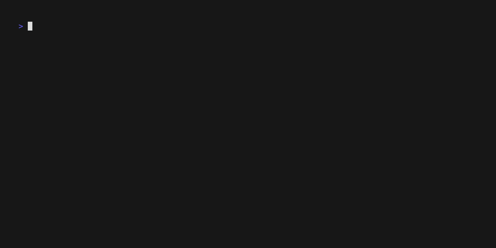

# DialectMorph



DialectMorph is a powerful code transpilation tool designed to convert source code from one programming language to another. It leverages the Groq API to perform intelligent code translations while maintaining the original functionality and logic.

## Features

- Supports transpilation between Python, JavaScript, Java, and C++
- Command-line interface for easy usage
- Automatically creates a `transpiledFiles` directory for output
- Utilizes Groq's language model for accurate code conversion
- User can also provide their own API-Key to be used in this CLI Tool
- User can also request the the list of models available in the Groq-API
- User can also specify the model that they want to use for their use-case

## Installation

1. Clone the repository:

   ```
   git clone https://github.com/Kannav02/DialectMorph.git
   cd DialectMorph
   ```

2. Install dependencies:

   ```
   bun install
   ```

   **To skip steps 3 and 4 , you can run the following script, which will run all of these commands in a single-go**

   ```
   bun run linkage:build

   ```

3. Run the following commands to have bun build/transpile typescript files to javascript so as to run the binary

   ```
   bun run build
   ```

4. Link and Install Bun Binaries in the Global Scope

   we would have to register the CLI tool globally and then also install the binaries in the global scope to make it useful in the terminal

   to register the CLI tool globally ,run the following command

   ```
   bun link
   ```

   after this,
   to install the bun binaries globally, run the following commmand

   ```
   bun link dialect-morph
   ```

5. Run the following commands in the terminal to make sure that .bun/bin exists in the path variable

   ```
   export PATH="/Users/username/.bun/bin:$PATH"
   ```

   reload the shell config file

   ```
   source ~/.zshrc
   ```

6. Set up your Groq API key:

   - Create a `.env` file in the root directory or run the following command in the shell

     ```
     cp .env.example .env

     ```

   - Add your Groq API key: `GROQ_API_KEY=your_api_key_here`

## Usage

Run DialectMorph using the following command:

### Main Command

```
dialectMorph <input_files...> -l <output_language>
```

The `input_files` argument can take multiple files at once and is a required argument
the `output_language` argument is also a required argument

Examples:

Take one of the files from the examples folder and run the following command

```
dialectMorph ./examples/example.py -l java
dialectMorph ./examples/example.cpp -l python
```

### Optional Arguments

- a (--api_key)
  This command is one of the optional arguments and can be used with the main command or the lm command (see below)

  Command

  ```
  dialectMorph ./examples/examples.py -l C++ -a YOUR_API_KEY

  ```

- m (--model)
  This command is one of the optional arguments and can be used with the main command to specify the model that you want to be used to fetch the request , by default the model is `llama3-8b-8192`

  **BE CAREFUL TO ONLY USE A MODEL NAME THAT EXISTS AFTER YOU USE THE LM OPTION OTHERWISE THE PROGRAM WILL THROW AN ERROR**

  Command

  ```
  dialectMorph ./example/example.py -l java -a YOUR_API_KEY -m MODEL_NAME

  ```

- lm (--list_models)
  This command can be used on its own without the need to provide any files and is used to fetch the list of models that are available on Groq, it can also take an API-Key as one of the optional arguments

  Command

  ```
   dialectMorph -lm -a YOUR_API_KEY

  ```

## Supported Languages

- Python (.py)
- JavaScript (.js)
- Java (.java)
- C++ (.cpp)

## Project Structure

- `index.ts`: Main entry point and CLI logic
- `LLMHandler.ts`: Handles interactions with the Groq API
- `fileHelper.ts`: Utility functions for file and directory operations

## Contributing

Before making any Pull Requests or Pushes to the main branch, make sure to run the following linting scripts to pass the tests set by the CI pipeline

```
bun run format
bun run format:check
```

`format` script here is used to format all of the files to the standards specified by prettier
`format:check` script here is used to check if all of the files have been formatted by prettier

Contributions are welcome! Please feel free to submit a Pull Request.

## License

This project is licensed under the [MIT License](LICENSE).

## Acknowledgements

- [Groq SDK](https://www.groq.com/) for providing the language model API
- [Commander.js](https://github.com/tj/commander.js/) for CLI argument parsing
- [Figlet](https://github.com/patorjk/figlet.js) for ASCII art text generation
- [Chalk](https://www.npmjs.com/package/chalk) for terminal styling
- [Ora](https://www.npmjs.com/package/ora) for terminal spinner
- [VHS](https://github.com/charmbracelet/vhs) for making the demo video for the CLI tool
- [Prettier](https://prettier.io/) for maintaining consistent formatting throughout the code
